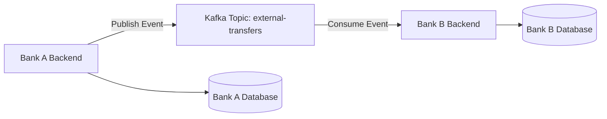

# Distributed Banking System

Event-driven multi-bank architecture with cross-bank transfers via Apache Kafka.

This project simulates independent banking nodes that communicate asynchronously through a distributed messaging backbone. Each bank operates as an isolated service with its own database, API, and frontend.

---

##  System Architecture



Each bank runs independently:

- FastAPI backend  
- SQLite database (accessed via SQLAlchemy ORM)  
- React teller/admin dashboard  
- Kafka producer and consumer  

Banks do **not** share databases. Communication occurs exclusively via Kafka events.

---

##  Consistency Model

### Same-Bank Operations

- Strong consistency  
- ACID transactions enforced at the persistence layer (SQLite via SQLAlchemy)  
- Synchronous REST execution  
- Atomic balance updates inside transactional boundaries  

Financial operations (deposit, withdraw, internal transfer) are wrapped in database transactions to prevent partial writes and maintain account integrity.

---

### Cross-Bank Transfers

- Event-driven architecture  
- Eventual consistency  
- Durable messaging via Kafka  
- Consumer offset replay for fault recovery  

Cross-bank transfers are handled asynchronously to preserve loose coupling and fault isolation.

---

##  Concurrency & Idempotency

### Concurrency Handling

- SQLite enforces transactional guarantees and write serialization.
- SQLAlchemy manages atomic transactions using session boundaries.
- Concurrent requests modifying the same account are safely serialized by the database engine.

This ensures balance updates remain consistent even under simultaneous requests.

---

### Idempotency Handling (Cross-Bank Events)

Kafka provides **at-least-once delivery**, meaning events may be replayed during failures.

To prevent duplicate credits:

- Each cross-bank transfer includes a unique `transaction_id`.
- The receiving bank checks whether the `transaction_id` already exists in its transaction log.
- If the transaction has already been processed, the event is ignored.
- If not, the transfer is applied and recorded.

This guarantees safe replay handling and prevents double-credit scenarios.

---

##  Tech Stack

Backend:
- Python 3.11
- FastAPI
- SQLAlchemy ORM
- SQLite
- kafka-python
- JWT-based authentication

Frontend:
- React
- Nginx (containerized)

Infrastructure:
- Apache Kafka
- Zookeeper
- Docker Compose

---

##  Running Locally

Clone repository:
```
git clone https://github.com/saumyapandyaa/distributed-banking-system.git  
cd distributed-banking-system  
```

Build containers:

```
docker compose build  
```

Start the system:
```
docker compose up -d  
```

Access services:

Bank 1 API → [http://localhost:8001/docs](http://localhost:8001/docs)  
Bank 2 API → [http://localhost:8002/docs](http://localhost:8002/docs)  
Bank 1 UI → [http://localhost:3001](http://localhost:3001)  
Bank 2 UI → [http://localhost:3002](http://localhost:3002)  

---

## What This Project Demonstrates

- Event-driven architecture  
- Distributed messaging with Kafka  
- Strong vs eventual consistency modeling  
- Idempotent event handling  
- Transactional concurrency control  
- JWT-based role separation  
- Containerized microservices  
- Clean separation between persistence and communication layers  

---

##  Future Enhancements

- Replace SQLite with PostgreSQL for higher concurrency workloads  
- Head Bank registry service for dynamic bank discovery  
- Dead-letter queues for failed events  
- Prometheus + Grafana observability  
- Kubernetes deployment  
- Horizontal scaling of bank nodes  
- Exactly-once semantics using Kafka transactional producers  
